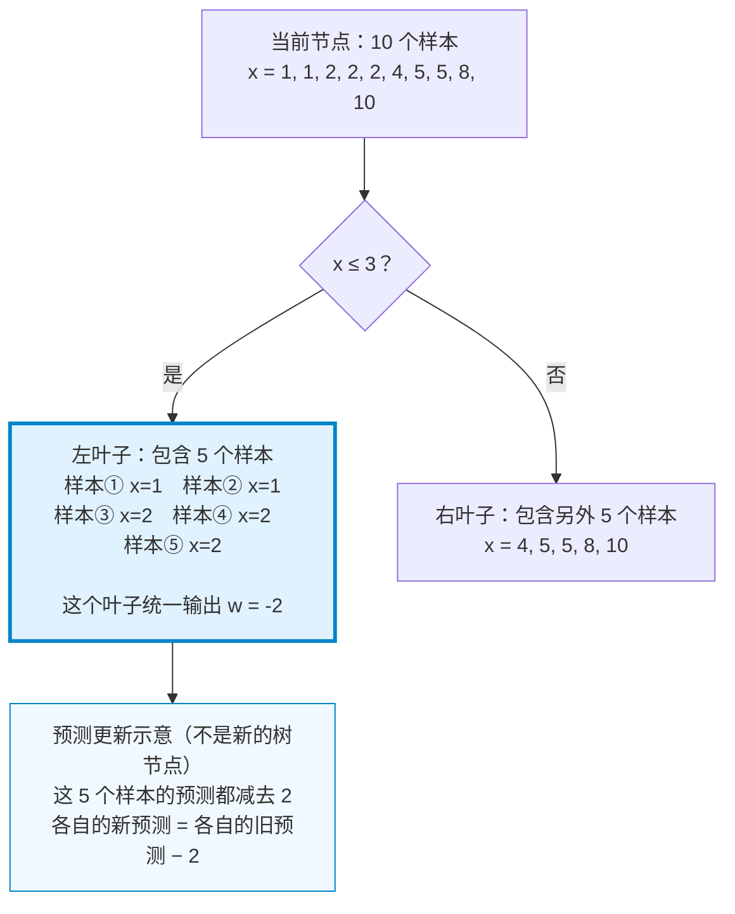
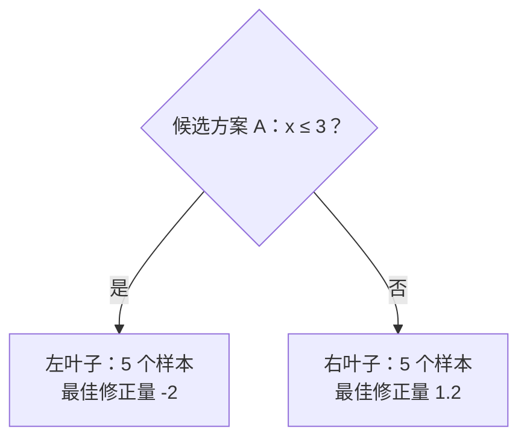
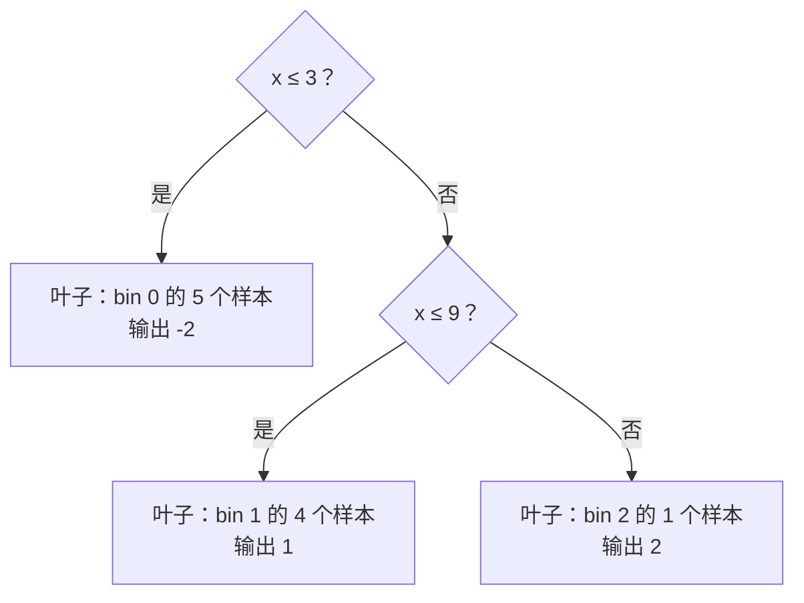
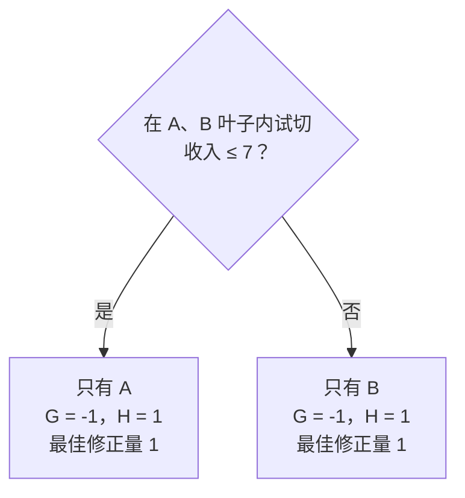
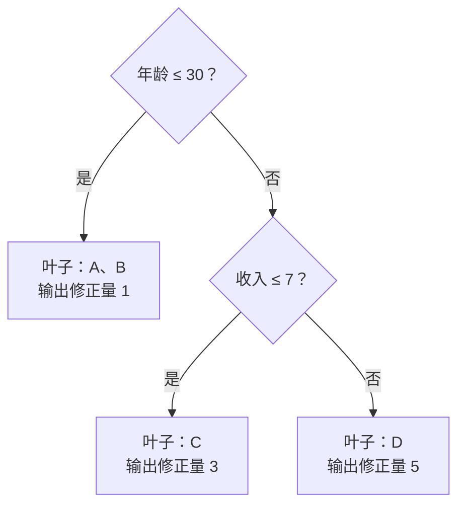

# LightGBM：怎么用 bin 找最佳切分

这篇笔记围绕一个问题展开：**连续特征被分成 bin 以后，LightGBM 怎样选出最好的一刀？** 先理解分箱如何产生候选位置，再推导每个叶子的得分，把两者连起来计算切分增益；然后扩展到多个特征如何共同构成一棵树，以及多棵树如何逐轮修正预测，最后把常见调参项对应到这些步骤。

## 1. 分箱：确定候选切分位置

bin 可以理解为一个“箱子”：把一段范围内的特征值归为一组，并用整数编号表示。对于数值特征，分箱保留了大小顺序，但同一个 bin 内的数值在本次分箱表示中不再区分。

### 1.1 连续特征怎样变成 bin

假设一个特征 $x$ 有 10 个样本，排序后为：

$$
x=[1,1,2,2,2,4,5,5,8,10].
$$

合并重复值，同时记录出现次数：

| 不同取值 $v$ | 1 | 2 | 4 | 5 | 8 | 10 |
| --- | --- | --- | --- | --- | --- | --- |
| 出现次数 $c$ | 2 | 3 | 1 | 2 | 1 | 1 |

总样本数 $N=10$。假设最多划分为 3 个 bin，即 $\text{max\_bin}=3$，平均每箱的目标样本数为：

$$
M=\frac{N}{\text{max\_bin}}=\frac{10}{3}\approx3.33.
$$

**下面使用一个固定目标容量的教学简化规则：从小到大装箱，累计数量达到或超过 $M$ 就结束当前箱，最后一箱接收剩余值。相同取值不拆开。这个规则用于理解分箱，并不是 LightGBM 源码的完整复现。**

第一箱先放入两个 1，累计数量 $S=2$；再放入三个 2，得到 $S=2+3=5$。达到目标容量后，第一箱结束，包含 $[1,1,2,2,2]$。当前最大值为 2，下一个不同值为 4，因此用中点作为边界：

$$
b_1=\frac{2+4}{2}=3.
$$

第二箱从 4 开始，依次放入一个 4、两个 5，累计数量为 $1+2=3$，仍小于 3.33；再加入一个 8，累计数量达到 4，于是结束。它包含 $[4,5,5,8]$，下一个值是 10，因此：

$$
b_2=\frac{8+10}{2}=9.
$$

最后一箱接收剩下的 10。由此得到：

| bin 编号 | 特征范围 | 当前样本 | 样本数 |
| --- | --- | --- | --- |
| 0 | $x\le3$ | 1, 1, 2, 2, 2 | 5 |
| 1 | $3<x\le9$ | 4, 5, 5, 8 | 4 |
| 2 | $x>9$ | 10 | 1 |

原始特征对应的 bin 编号就是：

$$
[0,0,0,0,0,1,1,1,1,2].
$$

这样一来，在这个没有缺失值的教学示例里，只需比较两种非空切分：在 bin 0 后面切，或者在 bin 1 后面切，分别对应 $x\le3$ 和 $x\le9$。bin 内部的候选阈值不再逐一尝试。

实际 LightGBM 分箱还会根据剩余样本和剩余箱数调整目标容量，并处理高频取值、最小箱样本数、零值和缺失值等。因此，**不能把上面的 3 和 9 当作真实 LightGBM 在该数据及默认参数下必然生成的边界**。相邻组之间取中点是常见构造方式，源码还包含浮点边界处理。参见 [LightGBM v4.6.0 分箱源码](https://github.com/microsoft/LightGBM/blob/v4.6.0/src/io/bin.cpp)。

### 1.2 分箱数量如何控制

每个特征分别建立自己的分箱边界。默认情况下，所有特征共用同一个 $\text{max\_bin}$ 上限，但并不共用边界，也不要求实际 bin 数相同。例如，年龄和收入即使都设置为 255，它们各自的分箱范围仍然不同。

$\text{max\_bin}$ 默认值为 255；需要分别指定上限时，可以使用 $\text{max\_bin\_by\_feature}$。某个特征只有少量不同取值时，不会为了达到 255 而硬凑出 255 个有效取值箱；实际数量还受合并规则及特殊值处理影响，也不能保证每个不同取值都独占一箱。参见 [官方参数文档](https://lightgbm.readthedocs.io/en/stable/Parameters.html#max_bin)。

更大的 $\text{max\_bin}$ 通常允许更细的划分，也可能增加候选切分数量、计算量和内存开销，同时给拟合噪声留下更多空间。所以它并不必然让模型更好。

## 2. 叶子得分：衡量预测修正的收益

分箱给出了候选位置，比较它们需要一个评价标准。无论在哪个位置切，都会得到左右两个叶子，因此先求清楚一个叶子的最佳修正量，以及它能带来多少收益。

### 2.1 建立叶子的优化目标

在梯度提升中，新树修正的是模型当前的预测。一个叶子只能输出同一个修正量 $w$：凡是进入这个叶子的样本，都在当前预测上加上这个数。

$$
\hat y_i^{\text{new}}=\hat y_i+w.
$$

这里 $\hat y_i$ 表示第 $i$ 个样本当前的模型输出；对于分类任务，它通常是用于目标函数计算的原始分数，而不是直接指预测概率。本节先不考虑学习率缩放；实际更新通常使用 $\eta w$，其中 $\eta$ 是学习率。

沿用前面的分箱，假设在 $x\le3$ 处分开，就可以直观看到：**一个叶子包含多个样本，它们共享的是修正量，而不是最终预测值。** 图中先用 $w=-2$ 示意，后文再推导这个输出如何计算。

例如，两个样本原来的预测分别为 10 和 7，进入这个叶子后，预测分别变成 8 和 5，并不是都变成 $-2$。因此，要为整个叶子选择一个合适的 $w$，就必须考虑叶子里所有样本的损失。

把真实标签固定，将单个样本的损失记为 $L_i(\hat y_i)$。在当前预测处做二阶 Taylor 展开：

$$
L_i(\hat y_i+w)
\approx L_i(\hat y_i)+g_iw+\frac12h_iw^2,
$$

其中：

$$
g_i=\frac{\partial L_i}{\partial\hat y_i},
\qquad
h_i=\frac{\partial^2L_i}{\partial\hat y_i^2}.
$$

$g_i$ 是一阶导数，描述预测稍微增加时，损失朝哪个方向、以多快的速度变化；$h_i$ 是二阶导数，描述这种变化的曲率。原损失 $L_i(\hat y_i)$ 是基准项，$g_iw$ 是线性变化，$\frac12h_iw^2$ 用来修正曲率造成的偏差。

为了让导数有具体含义，取平方损失：

$$
L_i(\hat y_i)=\frac12(\hat y_i-y_i)^2.
$$

那么 $g_i=\hat y_i-y_i$、$h_i=1$。例如真实值为 8、当前预测为 10，就有 $g_i=2$：预测偏高，应向下修正。对这种二次损失，二阶展开是精确的；一般损失下则是局部近似。

一个叶子里有多个样本，但它们共用同一个 $w$，所以可以把损失展开式相加：

$$
\begin{aligned}
\sum_iL_i(\hat y_i+w)
&\approx \sum_iL_i(\hat y_i)
+w\sum_i g_i+\frac12w^2\sum_i h_i\\
&=C+Gw+\frac12Hw^2,
\end{aligned}
$$

其中求和只覆盖当前叶子的样本，并定义：

$$
C=\sum_iL_i(\hat y_i),\qquad
G=\sum_i g_i,\qquad H=\sum_i h_i.
$$

$C$ 与 $w$ 无关，不影响最优修正量。加入 L2 正则项 $\frac12\lambda w^2$ 后，真正需要最小化的部分为：

$$
\boxed{Q(w)=Gw+\frac12(H+\lambda)w^2.}
$$

这里 $\lambda\ge0$ 控制对较大叶子输出的惩罚强度。以下推导只考虑这种 L2 正则，并假设 $H+\lambda>0$。

### 2.2 求出最优输出，再推导 Score

$Q(w)$ 是关于 $w$ 的二次函数，相当于 $aw^2+bw+c$，其中 $a=\frac12(H+\lambda)>0$、$b=G$、$c=0$。因为二次项系数为正，它是一条开口向上的抛物线，只有一个最低点。注意，只有满足 $a>0$ 时才能这样说，不能仅凭“二次函数”就认定开口向上。

对 $w$ 求导，并令导数等于零：

$$
\frac{dQ}{dw}=G+(H+\lambda)w=0.
$$

解得最优叶子输出：

$$
\boxed{w^*=-\frac{G}{H+\lambda}.}
$$

在这个公式中，如果总梯度 $G>0$，叶子输出为负，整体向下修正；如果 $G<0$，则整体向上修正。现在继续追问：使用最佳 $w^*$ 后，目标函数到底降低多少？

把 $w^*$ 代回 $Q(w)$：

$$
\begin{aligned}
Q(w^*)
&=G\left(-\frac{G}{H+\lambda}\right)
+\frac12(H+\lambda)
\left(-\frac{G}{H+\lambda}\right)^2\\
&=-\frac{G^2}{H+\lambda}
+\frac12\frac{G^2}{H+\lambda}\\
&=-\frac12\frac{G^2}{H+\lambda}.
\end{aligned}
$$

不做修正时，$w=0$，所以 $Q(0)=0$。最优修正相对于不修正的改善量为：

$$
Q(0)-Q(w^*)=\frac12\frac{G^2}{H+\lambda}.
$$

**这严格说是“带 L2 正则的二阶近似目标”的改善量。** 一般情况下，它不等于原始真实 loss 的精确下降量；对平方损失、$\lambda=0$ 且不缩放更新时，两者才在这里直接一致。

比较候选方案时，统一乘以 $\frac12$ 不改变大小关系，因此可以定义：

$$
\boxed{\operatorname{Score}(G,H)=\frac{G^2}{H+\lambda}.}
$$

Score 来自“先优化叶子输出，再代回目标函数”，不是随意定义的评分。它是上述目标改善量的两倍。省略 $\frac12$ 只是不影响排序；如果还要与一个固定增益阈值比较，阈值也必须采用相同的尺度。LightGBM 的基础叶子增益计算可参见 [v4.6.0 的 GetLeafGain 实现](https://github.com/microsoft/LightGBM/blob/v4.6.0/src/treelearner/feature_histogram.hpp)。

用原讨论中的数字验证：设 $G=20$、$H=4$、$\lambda=0$，则：

$$
w^*=-\frac{20}{4}=-5,\qquad
Q(w)=20w+2w^2.
$$

不修正时 $Q(0)=0$；采用最优修正时：

$$
Q(-5)=20(-5)+2(-5)^2=-100+50=-50.
$$

因此目标改善了 50，而 Score 为 $20^2/4=100$。这正好说明：Score 可以用于比较，但不能把 100 直接说成 loss 减少了 100。

## 3. 切分增益：选出收益最大的一刀

### 3.1 从一个叶子开始：试切，再比较收益

前面求出了一个叶子的最优修正量，但一棵树的结构还没有确定。**新树从一个叶子开始；算法先尝试候选切分，计算每种切法的最佳输出和收益，再决定是否正式切分。**

开始时，当前参与建树的样本都在同一个叶子里。如果不再切分，这棵新树就只输出一个统一修正量：

$$
w_P^*=-\frac{G_P}{H_P+\lambda}.
$$

这里 $P$ 表示准备尝试切分的父叶子。在树的起点，它包含全部样本；之后它也可以是树中某个准备继续切分的叶子。

但不同样本可能需要不同方向或大小的修正，因此算法接着尝试把这个叶子分成两组。前面的分箱给出了 $x\le3$ 和 $x\le9$ 两个候选位置。对于每个候选位置，先按条件分出左右样本，再分别汇总 $G_L,H_L$ 和 $G_R,H_R$，计算：

$$
w_L^*=-\frac{G_L}{H_L+\lambda},\qquad
w_R^*=-\frac{G_R}{H_R+\lambda}.
$$

这一步得到的是“如果这样切，左右两组各自最应该输出什么”的候选方案，还没有把这次切分正式写进树。不同候选位置产生不同的分组，也就可能产生不同的输出与收益。

接着要回答：**切成两个叶子，比保持一个叶子，多改善了多少？** 第 2 节已经推导出，一个叶子采用最佳输出后的目标改善量是 $\frac12\operatorname{Score}$。两种方案的收益可以放在同一基准下比较：

| 方案 | 相对于“新树完全不修正”的目标改善量 |
| --- | --- |
| 保持一个父叶子 | $\frac12\operatorname{Score}_P$ |
| 切成左右两个叶子 | $\frac12\operatorname{Score}_L+\frac12\operatorname{Score}_R$ |

左右两组样本互不重叠，它们的目标改善量可以相加。用切分后的改善量减去不切分的改善量，得到切分的额外收益：

$$
\begin{aligned}
\Delta
&=\frac12\operatorname{Score}_L
+\frac12\operatorname{Score}_R
-\frac12\operatorname{Score}_P\\
&=\frac12\left(\operatorname{Score}_L+
\operatorname{Score}_R-\operatorname{Score}_P\right).
\end{aligned}
$$

因此，省略比较时不影响大小关系的公共因子 $\frac12$，定义切分增益：

$$
\boxed{
\operatorname{Gain}
=\operatorname{Score}_L+\operatorname{Score}_R-\operatorname{Score}_P
=\frac{G_L^2}{H_L+\lambda}
+\frac{G_R^2}{H_R+\lambda}
-\frac{G_P^2}{H_P+\lambda}.
}
$$

减去父叶子 Score，是因为不切分也能采用最优的统一修正量；这部分收益不能算成切分的额外贡献。**叶子输出公式评价候选分组应该怎样修正，Gain 则评价这次试切是否值得成为树的一部分。** 下面沿用同一组数据，把试切、比较和正式切分连起来算。

### 3.2 按 bin 汇总，并逐一计算候选增益

继续使用第 1 节的三个 bin。为了计算梯度，补充真实标签与当前预测：设所有样本当前预测为 0，bin 0 的标签都为 $-2$，bin 1 的标签都为 1，bin 2 的标签为 2。采用前面的平方损失，则 $g_i=\hat y_i-y_i$，每个样本的 $h_i=1$。

对当前节点，按 bin 汇总样本数 $n_b$、梯度和 $G_b$、二阶导数和 $H_b$：

| bin | 样本数 $n_b$ | 每个样本的 $g_i$ | 梯度和 $G_b$ | 二阶导数和 $H_b$ |
| --- | --- | --- | --- | --- |
| 0 | 5 | 2 | 10 | 5 |
| 1 | 4 | -1 | -4 | 4 |
| 2 | 1 | -2 | -2 | 1 |
| 合计 | 10 | — | 4 | 10 |

这就是用于计算的直方图：除了频数，还保存梯度和二阶导数的合计。标签与当前预测是为了演示新增的条件，不能仅凭原始特征 $x$ 推出梯度。先设 $\lambda=0$，暂不施加最小叶子样本数等限制。

如果不切，整个节点就是父叶子，$G_P=4$、$H_P=10$。它的最佳统一修正量和得分分别为：

$$
w_P^*=-\frac4{10}=-0.4,\qquad
\operatorname{Score}_P=\frac{4^2}{10}=1.6.
$$

如果就此停止，新树会让这 10 个样本的当前预测都减去 $0.4$。现在试着让两组样本分别选择修正量，检查是否能比这个方案更好。

**第一种切法：在 bin 0 后面切，即 $x\le3$ 放左边，其余放右边。** 左叶子只有 bin 0，右叶子包含 bin 1 和 bin 2：

$$
G_L=10,\ H_L=5;\qquad G_R=-4-2=-6,\ H_R=4+1=5.
$$

用叶子输出公式，得到这次试切对应的最佳修正量：

$$
w_L^*=-\frac{10}{5}=-2,\qquad
w_R^*=-\frac{-6}{5}=1.2.
$$

这时还没有正式采用方案 A，需要先算收益，再与另一个候选方案比较。代入增益公式：

$$
\operatorname{Gain}_A
=\frac{10^2}{5}+\frac{(-6)^2}{5}-\frac{4^2}{10}
=20+7.2-1.6=25.6.
$$

**第二种切法：在 bin 1 后面切，即 $x\le9$ 放左边，其余放右边。** 左叶子包含 bin 0 和 bin 1，右叶子只有 bin 2：

$$
G_L=10-4=6,\ H_L=5+4=9;\qquad G_R=-2,\ H_R=1.
$$

这次左右叶子的最优输出分别为 $-6/9=-2/3$ 和 $-(-2)/1=2$。候选方案变了，分组和修正量也随之变化。其增益为：

$$
\operatorname{Gain}_B
=\frac{6^2}{9}+\frac{(-2)^2}{1}-\frac{4^2}{10}
=4+4-1.6=6.4.
$$

因为 $25.6>6.4$，在两个候选位置都合法时，算法正式选择方案 A：**把原来的父叶子替换成判断节点 $x\le3$，并建立两个输出分别为 $-2$ 和 $1.2$ 的叶子。** 新树到这里才真正从一个叶子长出第一条分支。

用真实平方损失再核对一次：当前所有预测为 0，总损失为：

$$
\frac12\left[5\times2^2+4\times1^2+1\times2^2\right]=14.
$$

不切分时，用最佳统一修正量 $-0.4$，损失降到 13.2；按第一种切法分别输出 $-2$ 和 $1.2$ 后，损失为：

$$
\frac12\left[5\times0^2+4\times(1.2-1)^2+(1.2-2)^2\right]=0.4.
$$

所以相对于最佳的不切分方案，改善为 $13.2-0.4=12.8$，恰好等于 $\frac12\times25.6$。这也验证了父叶子得分为什么要减掉，以及公共因子 $\frac12$ 的含义。

### 3.3 累加扫描 bin，筛选合法切分

扫描候选边界时，不必为每一刀重新遍历所有样本。先建立当前节点各 bin 的统计量，然后从左到右累加：

$$
G_L(k)=\sum_{b=0}^{k}G_b,\qquad
H_L(k)=\sum_{b=0}^{k}H_b.
$$

右侧直接用父节点总量减去左侧：

$$
G_R(k)=G_P-G_L(k),\qquad
H_R(k)=H_P-H_L(k).
$$

例如从“bin 0 后切”移到“bin 1 后切”，只需把 bin 1 的统计量加入左边、从右边减去，再计算一次 Gain。构建好直方图后，单个数值特征的边界扫描成本随 bin 数增长，而不是随原始不同取值数量增长。

实际训练还要判断候选切分是否合法，例如检查最小叶子样本数、最小 Hessian 和，以及最小切分增益。本文只有 10 个样本，不能直接套用默认训练参数期待得到演示中的树；尤其右侧只有一个样本的方案可能被约束排除。启用 L1 正则、单调约束或其他叶子输出限制时，也需要使用相应的得分与输出规则。

### 3.4 继续切分，直到新树停止生长

第一刀确定后，树中有两个叶子。算法再对现有叶子尝试候选切分，为每个叶子找出它能达到的最佳合法增益，然后选择增益最大的叶子继续切分。这是 LightGBM 的 [按叶子选择最大收益继续生长的方式](https://lightgbm.readthedocs.io/en/stable/Features.html#leaf-wise-best-first-tree-growth)。

在这个教学例子里，左叶子的样本都在 bin 0 中，该特征已经没有可用的非空切分。右叶子还包含 bin 1 和 bin 2，可以在 $x\le9$ 处分开。右叶子目前的 Score 为 $(-6)^2/5=7.2$，如果拆开，两个子叶子的 Score 分别为 $(-4)^2/4=4$ 和 $(-2)^2/1=4$，所以继续切分的增益为：

$$
\operatorname{Gain}_{\text{右叶子}}=4+4-7.2=0.8.
$$

如果训练约束允许，并且叶子数量上限设为 3，就可以采用这次切分，得到下面这棵三叶子树：

这里原来右叶子的输出 $1.2$ 被两个新叶子的输出 1 和 2 替代。**样本在这棵新树中沿条件走到最终叶子，只取得那个叶子的输出；不会把父叶子和子叶子的输出累加。** 当前模型已有的预测再加上这棵树的输出，才得到更新后的预测；考虑学习率时，加的是 $\eta w$。

实际训练会在达到叶子数或深度等限制、没有合法候选切分，或候选增益不足时停止继续生长。本文的三叶子树是假定上述切分都被允许的教学结果。

### 3.5 多个特征怎样参与同一棵树

前面只比较了一个特征 $x$ 上的候选位置。多个特征时，每个特征分别分箱、产生自己的边界；算法在当前准备切分的叶子中，比较各个允许使用的特征及其候选位置。因此，一次切分选择的是 **“特征 + 该特征上的切分边界”**。

为了看清不同特征如何分组，下面换用一组包含两个特征的四样本数据。此后继续用这一组数据讨论后续切分和多棵树，不再中途改变标签。仍采用平方损失、$\lambda=0$，忽略最小叶子样本数等约束；当前预测从 0 开始是教学设定，不代表真实训练的默认初始预测。

| 样本 | 年龄 | 收入 | 真实值 $y$ | 当前预测 $\hat y$ | 梯度 $g_i=\hat y_i-y_i$ |
| --- | --- | --- | --- | --- | --- |
| A | 20 | 5 | 1 | 0 | -1 |
| B | 20 | 9 | 1 | 0 | -1 |
| C | 40 | 5 | 3 | 0 | -3 |
| D | 40 | 9 | 5 | 0 | -5 |

假设分箱分别保留年龄的两个取值 20、40 和收入的两个取值 5、9，则候选边界为年龄 30 和收入 7。每个样本的 $h_i=1$，根叶子的统计量及得分为：

$$
G_P=-1-1-3-5=-10,\qquad H_P=4,\qquad
\operatorname{Score}_P=\frac{(-10)^2}{4}=25.
$$

**梯度属于样本。尝试不同特征，只会把同一批样本分成不同的组，不会改变这些样本本轮的梯度。** 按年龄汇总和按收入汇总，就是把这些相同的梯度分别累加进两个特征各自的 bin。

尝试“年龄 $\le30$”：左边是 A、B，右边是 C、D，得到：

$$
G_L=-1-1=-2,\ H_L=2;\qquad
G_R=-3-5=-8,\ H_R=2.
$$

所以：

$$
\operatorname{Gain}_{\text{年龄}}
=\frac{(-2)^2}{2}+\frac{(-8)^2}{2}-25
=2+32-25=9.
$$

尝试“收入 $\le7$”：左边变成 A、C，右边变成 B、D，得到：

$$
G_L=-1-3=-4,\ H_L=2;\qquad
G_R=-1-5=-6,\ H_R=2.
$$

所以：

$$
\operatorname{Gain}_{\text{收入}}
=\frac{(-4)^2}{2}+\frac{(-6)^2}{2}-25
=8+18-25=1.
$$

因为 $9>1$，第一刀选“年龄 $\le30$”。左叶子的最佳输出是 $-(-2)/2=1$，右叶子的最佳输出是 $-(-8)/2=4$。树此时有一个使用年龄的判断节点，以及两个分别包含 A、B 和 C、D 的叶子。

### 3.6 为什么只继续拆右叶子：比较各叶子的最佳增益

第一刀之后，不能仅凭“收入还能把样本分开”就决定继续拆分。需要分别检查每个现有叶子中，最好的合法切分能带来多少额外收益。在本例的两个叶子中，年龄都已相同，但收入仍然可以分组。

先看左叶子 A、B。它的当前最佳统一输出为 1，Score 为：

$$
\operatorname{Score}_{AB}=\frac{(-1-1)^2}{2}=2.
$$

如果尝试在这个叶子内按“收入 $\le7$”切，A 和 B 会分别进入两个新叶子：

两个新叶子的 Score 都为 $(-1)^2/1=1$，因此：

$$
\operatorname{Gain}_{\text{拆开 A、B}}=1+1-2=0.
$$

拆之前，两人统一加 1；拆之后，两人仍然各自加 1。预测效果完全一样，额外的分支没有带来改善，所以左叶子保留。

再看右叶子 C、D。它目前统一输出 4，Score 为 $(-3-5)^2/2=32$。按“收入 $\le7$”拆开，C 的最佳输出为 3、Score 为 9；D 的最佳输出为 5、Score 为 25。因此：

$$
\operatorname{Gain}_{\text{拆开 C、D}}=9+25-32=2.
$$

| 待切分的叶子 | 保持一个叶子的输出 | 按收入拆开的输出 | 切分 Gain |
| --- | --- | --- | --- |
| A、B | 统一输出 1 | A 输出 1，B 输出 1 | 0 |
| C、D | 统一输出 4 | C 输出 3，D 输出 5 | 2 |

左叶子的最佳继续切分收益为 0，右叶子为 2。在这些切分都合法、叶子数量上限允许继续生长时，选择拆右叶子。得到的树为：

所以，**不同特征可以出现在同一棵树的不同判断节点上；一个特征也可以在一棵树中被多次使用。** 普通数值切分每次使用一个特征，判断节点负责指路，最终叶子负责输出修正量。例如 D 的年龄为 40，先走右边；收入为 9，再走右边，最终取得输出 5。

这里有两层比较：先在每个叶子内找出最佳的“特征 + 边界”，再比较各叶子的最佳增益，选择下一次真正采用的切分。判断依据是分组后分别修正能否带来额外改善，而不是特征能否把样本分开。

## 4. 多棵树：根据更新后的预测逐轮修正

第 3 节说明了多个特征怎样参与一棵树。现在把这棵树放回梯度提升模型中，继续使用 A、B、C、D 这组数据。**一棵树内部的节点逐步确定分组，多棵树之间则通过预测更新和梯度重算，进行多轮学习。**

### 4.1 第一棵树完成后，怎样更新预测

将上一节得到的树记为 $f_1(x)$。这里 $x$ 表示一个样本的完整特征，例如 D 的 $x=(40,9)$，而 $f_1(x)$ 表示该样本沿第一棵树走到最终叶子时取得的修正量。

按 A、B、C、D 的顺序，第一棵树给出的输出为：

$$
f_1(x)=[1,1,3,5].
$$

实际更新通常乘以学习率 $\eta$，控制每次采用多少修正量。设 $\eta=0.5$，就是先采用一半修正。这里的 $f_1$ 表示缩放前的输出，更新时再显式乘以 $\eta$；学习率的作用参见 [官方参数说明](https://lightgbm.readthedocs.io/en/stable/Parameters.html#learning_rate)。

用上标 $(0)$ 表示尚未加入第一棵树的预测，$(1)$ 表示第一轮更新后的预测。初始预测为 $[0,0,0,0]$，所以：

$$
\begin{aligned}
\hat y^{(1)}
&=\hat y^{(0)}+\eta f_1(x)\\
&=[0,0,0,0]+0.5[1,1,3,5]\\
&=[0.5,0.5,1.5,2.5].
\end{aligned}
$$

| 样本 | 真实值 $y_i$ | 第一轮后的预测 $\hat y_i^{(1)}$ | 还差多少：$y_i-\hat y_i^{(1)}$ |
| --- | --- | --- | --- |
| A | 1 | 0.5 | 0.5 |
| B | 1 | 0.5 | 0.5 |
| C | 3 | 1.5 | 1.5 |
| D | 5 | 2.5 | 2.5 |

第一棵树的缩放前输出在这个简单例子里恰好能补齐全部误差，但学习率只采用了一半，所以还有误差留给后续树修正。一般任务中，一棵受约束的树也未必能完全表达所需的修正量。

### 4.2 第二棵树从哪里来

**第二棵树根据第一轮更新后的预测，重新计算梯度，然后重新从一个叶子开始建树。** 它面对的是同一组特征和标签，但当前预测已经改变，因此用于计算切分收益的梯度也改变了。

平方损失下，第二轮的梯度为：

$$
g_i^{(2)}=\hat y_i^{(1)}-y_i,
$$

代入表中的值，得到：

$$
g^{(2)}=[-0.5,-0.5,-1.5,-2.5],\qquad h_i^{(2)}=1.
$$

第二棵树继续按第 3 节的方法，尝试年龄和收入的候选切分。比如根叶子的 $G=-5,H=4$；按年龄切时，左侧 $G=-1,H=2$，右侧 $G=-4,H=2$，于是：

$$
\operatorname{Gain}^{(2)}_{\text{年龄}}
=\frac{(-1)^2}{2}+\frac{(-4)^2}{2}-\frac{(-5)^2}{4}
=0.5+8-6.25=2.25.
$$

收入候选的计算也相同：左侧是 A、C，$G=-2,H=2$；右侧是 B、D，$G=-3,H=2$，增益为 $2+4.5-6.25=0.25$。把第一轮与第二轮的切分结果放在一起，可以看清哪些地方改变了：

| 候选操作 | 第一轮 Gain | 第二轮 Gain |
| --- | --- | --- |
| 根叶子按年龄 $\le30$ 切 | 9 | 2.25 |
| 根叶子按收入 $\le7$ 切 | 1 | 0.25 |
| 年龄切分后的 A、B 叶子按收入继续切 | 0 | 0 |
| 年龄切分后的 C、D 叶子按收入继续切 | 2 | 0.5 |

因此，在本例中且约束允许时，第二棵树仍先选年龄，再拆 C、D 所在的右叶子。它可以得到与第一棵树相同的分支结构，但三个叶子的修正量变成：

$$
w_{AB}=-\frac{-0.5-0.5}{2}=0.5,\qquad
w_C=-\frac{-1.5}{1}=1.5,\qquad
w_D=-\frac{-2.5}{1}=2.5.
$$

所以：

$$
f_2(x)=[0.5,0.5,1.5,2.5].
$$

两棵树结构相同是这组数据下的结果。一般情况下，每轮的新梯度会影响收益比较，后一棵树可以选择不同的特征、切分位置和结构。

第二轮再采用一半修正量：

$$
\begin{aligned}
\hat y^{(2)}
&=\hat y^{(1)}+0.5f_2(x)\\
&=[0.5,0.5,1.5,2.5]+0.5[0.5,0.5,1.5,2.5]\\
&=[0.75,0.75,2.25,3.75].
\end{aligned}
$$

预测进一步接近真实值 $[1,1,3,5]$。第三棵树会针对这次更新后仍然存在的误差，重新计算梯度并开始新一轮建树。

### 4.3 区分一棵树内的生长和树之间的更新

| 过程 | 梯度如何使用 | 发生的变化 |
| --- | --- | --- |
| 一棵树内部继续切分 | 使用本轮建树前算出的梯度与二阶导数 | 选择特征和边界，逐步确定节点与最终叶子 |
| 完成当前树，进入下一棵树 | 更新预测，再重新计算梯度与二阶导数 | 从一个叶子开始，重新建立一棵修正树 |

因此，一棵新树的第一刀确定后，还没有把那个候选叶子修正正式加进模型，也不会在每次长出一个节点后都重算梯度。整棵树形成并完成本轮更新后，下一棵树才根据新的预测继续学习。

对一个样本，每棵树都从自己的根节点开始判断，给出一个最终叶子输出。这些树的贡献与初始预测相加，构成整个模型的预测。设完成了 $T$ 棵树，并使用相同学习率 $\eta$，则：

$$
\boxed{
\hat y^{(T)}(x)
=\hat y^{(0)}(x)+\eta f_1(x)+\eta f_2(x)+\cdots+\eta f_T(x).
}
$$

例如 D 的初始预测为 0，在第一棵树取得输出 5，在第二棵树取得输出 2.5，两轮之后的预测就是 $0+0.5\times5+0.5\times2.5=3.75$。

特征数量决定每次切分有哪些可比较的选择；树的数量决定模型完成了多少轮学习与修正。上面的逐轮计算针对平方损失回归：一般目标函数仍通过梯度与二阶导数学习修正，但修正量不一定能直接解释成“真实值减当前预测”。

### 4.4 训练轮数就是树的数目吗

对于本文的普通回归 GBDT，通常每轮新增一棵树，因此从零训练、实际完成 $T$ 轮时，通常就新增了 $T$ 棵树。二分类 GBDT 也通常如此。例如第一轮建 $f_1$，更新预测；第二轮建 $f_2$，再更新预测。

但“轮”表示一次完整的提升更新，不总是等于一棵树。LightGBM 的多分类通常每轮为每个类别建立一棵树：有 $K$ 个类别，完成 $T$ 轮，新增树的总数通常为 $K\times T$。例如三个类别完成 100 轮，通常得到 300 棵树。参见 [官方训练轮数说明](https://lightgbm.readthedocs.io/en/stable/Parameters.html#num_iterations)。

`num_iterations` 设置的是训练轮数上限。启用早停后，实际训练可能没有达到这个上限；验证表现最佳的轮数也可能早于触发早停的轮数。因此，要区分配置的轮数上限、实际完成轮数和最佳轮数。继续训练已有模型时，已有的树也要另行计入总数。

## 5. 调参：沿着建树过程控制模型

理解了分箱、叶子和逐轮更新，参数就可以对应到这些过程：分箱有多细、一棵树允许长多复杂、每个叶子的修正有多大，以及最多进行多少轮学习。以下说明针对普通 `gbdt` 模式，建议先掌握 `num_leaves`、`min_data_in_leaf`、`learning_rate` 和训练轮数，再逐步考虑正则与抽样。

### 5.1 控制一棵树的结构

| 参数 | 控制什么 | 调大后的影响 |
| --- | --- | --- |
| `num_leaves` | 每棵树最多有多少叶子 | 允许更复杂的分组，也更容易拟合噪声 |
| `max_depth` | 根到叶子的最大深度 | 允许更长的判断路径 |
| `min_data_in_leaf` | 叶子的最小样本数要求，内部采用 Hessian 近似 | 限制小样本分组，使树更保守 |
| `min_gain_to_split` | 一次切分需要超过的增益门槛 | 阻止收益很小的切分 |

沿用 A、B、C、D 的例子，`num_leaves=2` 时，按年龄切完已经达到两个叶子的上限，不能再拆 C、D；设为 3 才允许第三个叶子出现。但叶子上限只是允许继续生长，不保证一定长满。A、B 的收入切分 Gain 为 0，增加上限也不会使这刀变得有收益。

本例每个样本的 Hessian 都为 1，若 `min_data_in_leaf=2`，把 C、D 拆成两个单样本叶子就不符合要求。实际目标函数的 Hessian 可能不同，官方说明该最小样本数检查使用近似，因此不能在所有任务下把它理解为绝对精确的计数约束。

优先调 `num_leaves` 和 `min_data_in_leaf`：前者控制最多能分多少组，后者限制每组至少需要多少数据支持。`max_depth` 可以额外限制过长的分支；它为非正值时不限制深度。LightGBM 按叶子生长，不能只依靠深度控制复杂度。若设置正的最大深度，还应保证 `num_leaves` 不超过 $2^{\text{max\_depth}}$，并考虑使用更小的叶子数。参见 [官方树结构调参指南](https://lightgbm.readthedocs.io/en/stable/Parameters-Tuning.html#tune-parameters-for-the-leaf-wise-best-first-tree)。

### 5.2 控制叶子修正的强度

| 参数 | 控制什么 | 调大后的影响 |
| --- | --- | --- |
| `lambda_l2` | 对叶子输出施加 L2 正则 | 通常使修正量更小 |
| `lambda_l1` | 对叶子输出施加 L1 正则 | 可将较弱的修正压到 0 |

第 2 节公式 $w^*=-G/(H+\lambda)$ 中，$\lambda$ 对应基础情形下的 `lambda_l2`。例如 $G=-8,H=2$，不加 L2 时输出为 4；设 `lambda_l2=2`，输出变成：

$$
w^*=-\frac{-8}{2+2}=2.
$$

它会同时影响叶子输出和切分收益。启用 L1 后，梯度需要进行阈值处理，不能继续直接使用只有 L2 的公式。可以先以 L2 作为一个正则调节项，观察验证集表现是否改善。

### 5.3 控制训练轮数、学习率和早停

| 参数或机制 | 控制什么 | 调整时要注意 |
| --- | --- | --- |
| `learning_rate` | 每棵树的修正采用多少 | 越小，通常需要更多轮 |
| `num_iterations` | 最多训练多少轮 | 轮数与树数的关系见 4.4 节 |
| Early stopping，早停 | 验证集连续多少轮没有足够改善就停止 | 需要独立验证集及合适的评价指标 |

比如某棵树输出 4，学习率为 0.1，本轮加上 0.4；学习率为 0.05，本轮加上 0.2。学习率和轮数要一起考虑：降低学习率，却保持很少的轮数，可能使模型来不及学充分。

可以先设较大的轮数上限，用早停选择合适轮数。例如最多训练 2,000 轮，验证集连续 100 轮没有改善就停止；在 Python 中可使用 `early_stopping(stopping_rounds=100)` 回调，并提供验证集、记录最佳轮数。早停并不等于一遇到比上一轮差的结果就立即停止，允许的等待轮数有助于避免过早停止。参见 [官方早停说明](https://lightgbm.readthedocs.io/en/stable/pythonapi/lightgbm.early_stopping.html)。

### 5.4 调整分箱与随机抽样

| 参数 | 控制什么 | 常见作用 |
| --- | --- | --- |
| `max_bin` | 每个特征最多分多少箱 | 更大允许更细的候选边界，但可能更慢 |
| `feature_fraction` | 每棵树随机使用多少比例的特征 | 增加随机性，可能缓解过拟合并加快训练 |
| `bagging_fraction` | 每次抽样使用多少比例的训练样本 | 增加随机性，可能缓解过拟合 |
| `bagging_freq` | 每隔多少轮重新抽样 | 普通 bagging 中要大于 0，样本抽样才生效 |

例如 `feature_fraction=0.8`，每棵树随机选择约 80% 的特征；同时设置 `bagging_fraction=0.8`、`bagging_freq=1`，则每轮重新无放回抽取约 80% 的训练样本。在普通 bagging 配置下，仅降低 `bagging_fraction` 而保持 `bagging_freq=0`，不会启用这项抽样。

这也补充了前面“比较各个特征”的适用条件：启用特征抽样时，比较的是本轮允许使用的特征。分箱上限与实际 bin 数的关系已在 1.2 节说明，可以先保留默认 `max_bin=255`，等训练速度或候选精度成为明显问题时再调整。

### 5.5 建议的调参顺序与试验起点

先确定任务对应的 `objective` 和评价指标 `metric`。预测连续值、二分类与排序的目标函数不同，指标也应与要解决的问题一致。然后固定训练与验证划分：若预测未来，用时间顺序划分；有同一对象的重复记录时，也要避免相关记录跨集合造成验证结果偏乐观。最终测试集保留到调参结束后再评价。

建议按顺序推进，而不是一次修改所有参数：

1. 建立基线：固定学习率，使用早停，记录训练集与验证集表现。
2. 调树的复杂度：主要比较 `num_leaves` 与 `min_data_in_leaf` 的组合。
3. 如果过拟合，尝试正则、特征抽样和样本抽样。
4. 结构较合适后，再降低学习率，并给更充足的训练轮数。
5. 最后再调 `max_bin`，除非速度或分箱精度已经是明显问题。

下面是普通表格任务的一组试验起点，属于建议，不是所有任务的最佳配置；数据很少时尤其要重新选择最小叶子样本数。

| 参数 | 起点或第一批候选值 |
| --- | --- |
| `learning_rate` | 先固定为 0.05 |
| `num_iterations` | 上限 2000，配合早停 |
| `num_leaves` | 比较 15、31、63 |
| `min_data_in_leaf` | 比较 20、50、100，根据样本量调整 |
| `max_depth` | 先不限制；需要限制深分支时尝试 5、7、9，同时约束叶子数 |
| `lambda_l2` | 基线用 0，再比较 1、10 |
| `feature_fraction` | 基线用 1.0，再尝试 0.8 |
| `bagging_fraction` | 基线用 1.0，再尝试 0.8，同时启用 `bagging_freq` |
| `max_bin` | 先用默认 255 |

训练集很好而验证集明显差时，优先减少叶子数、增加叶子最小样本数，或加强正则与抽样；训练集和验证集都差时，先检查特征、标签和目标函数，再考虑允许更复杂的树或更多轮数。验证结果决定是否保留某次调整，不能仅因为训练损失下降就判断参数更好。

第 1 至第 4 节说明模型怎样构建，第 5 节的参数则约束这个过程：叶子数量和样本要求决定怎样分组，学习率决定每轮走多大一步，轮数与早停决定学习何时结束。

## 参考资料与范围

- [LightGBM 官方调参指南](https://lightgbm.readthedocs.io/en/stable/Parameters-Tuning.html)：核对树结构、抽样和训练轮数之间的关系。
- [LightGBM 官方特性说明](https://lightgbm.readthedocs.io/en/stable/Features.html)：核对直方图扫描和按叶子生长的方式。
- [LightGBM 官方参数文档](https://lightgbm.readthedocs.io/en/stable/Parameters.html)：核对分箱参数及训练约束。
- [LightGBM v4.6.0 分箱源码](https://github.com/microsoft/LightGBM/blob/v4.6.0/src/io/bin.cpp)：区分教学分箱与实际实现。
- [LightGBM v4.6.0 直方图与叶子增益源码](https://github.com/microsoft/LightGBM/blob/v4.6.0/src/treelearner/feature_histogram.hpp)：核对基础叶子输出、得分和切分比较。

本文根据学习讨论整理，聚焦数值特征、二阶目标和基础 L2 正则情形。第 1 节保留原讨论的简化分箱；第 3 节从单特征扩展到多特征切分，第 4 节沿用多特征示例计算逐轮预测更新，并区分训练轮数与树数；第 5 节整理常见参数及调参建议。源码参考固定为 v4.6.0，不代表覆盖所有版本、目标函数和训练模式。
